# Support Ticket: Troubleshooting Broken GCP Web Server Environment

## Overview

This support ticket documents the troubleshooting process used to identify and resolve access issues in a broken Google Cloud Platform environment. The environment was intentionally deployed in a misconfigured state using a supplied script.

The goal was to inspect the deployed infrastructure, identify each misconfiguration, apply the required fixes, and restore access to the web server.

---

## Step Zero: Replicate the Broken Environment

To begin, we ran the supplied `curl` command to deploy the broken environment:

```bash
curl -s https://storage.googleapis.com/static-site-bucket-522479235074/broken-env-with-prechecks-v2.sh | bash
```

This script built out a broken GCP environment that we were tasked with troubleshooting.

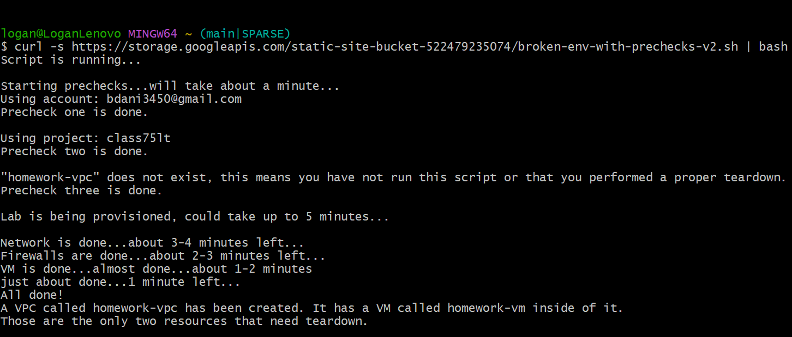

---

## Step 1: Review the Infrastructure Created by the Script

After the script completed, we reviewed the resources that were created.

The script built the following infrastructure:

- A custom VPC named `homework-vpc`
- A single subnet in `us-central1`
- A VM named `homework-vm`
- Three firewall rules:
  - `homework-deny-all`
  - `homework-allow-ssh`
  - `homework-allow-http`
- A `deny-all` firewall rule with a service account attached
- A VM that was initially stopped
- Firewall rules that were not properly allowing traffic
- A VM network tag for SSH access

At this point, the web server was not reachable.

---

## Step 2: Assign an Ephemeral Public IP Address

The first issue we noticed was that the VM did not have an external IP address assigned.

To begin troubleshooting external access, we edited the VM network interface and assigned an ephemeral public IP address.

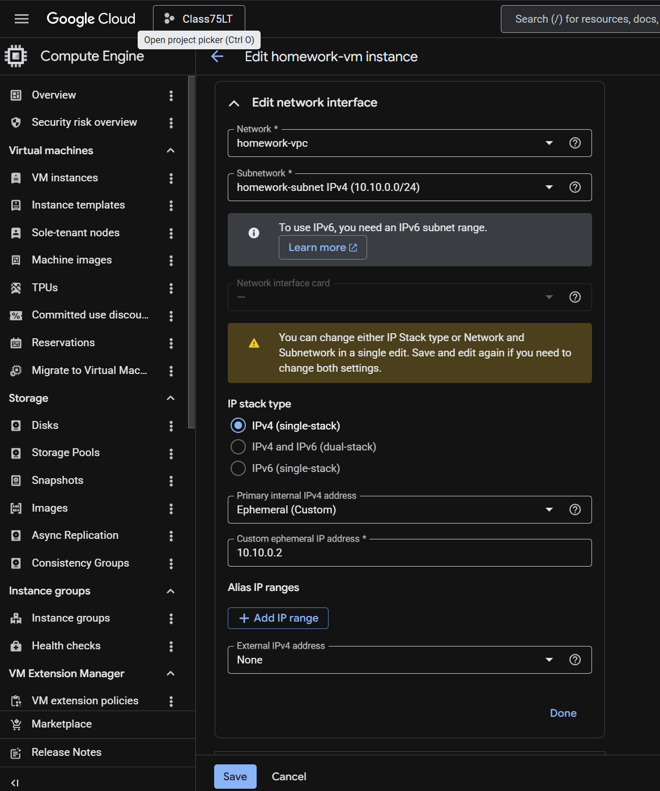

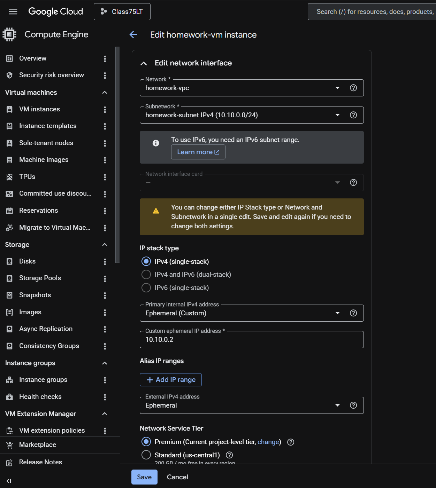

After assigning the ephemeral IP, we restarted the VM and attempted to access the web server again.

The web server was still not reachable.

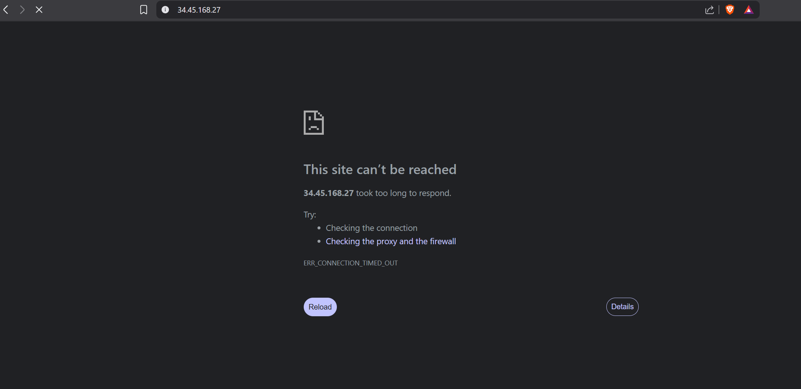

---

## Step 3: Inspect Firewall Rules

Next, we reviewed the firewall rules created by the script.

The main issue we noticed was that the `homework-deny-all` firewall rule had a priority of `0`.

This is a major problem because lower priority numbers are evaluated first in GCP firewall rules. A priority of `0` means the deny rule is evaluated before the allow rules, effectively blocking traffic before the `allow-ssh` and `allow-http` rules can apply.

The firewall rules were configured roughly as follows:

| Firewall Rule | Action | Port | Priority | Issue |
| --- | --- | --- | ---: | --- |
| `homework-deny-all` | Deny | All | `0` | Deny rule was too high priority |
| `homework-allow-ssh` | Allow | `22` | `1000` | Lower priority than the deny rule |
| `homework-allow-http` | Allow | `80` | `1000` | Lower priority than the deny rule |

---

## Step 4: Adjust Firewall Rule Priorities

To correct the firewall priority issue, we changed the rules so the allow rules would be evaluated before the deny rule.

The updated priorities were:

| Firewall Rule | New Priority | Reason |
| --- | ---: | --- |
| `homework-allow-http` | `100` | Allow HTTP traffic before the deny-all rule |
| `homework-allow-ssh` | `200` | Allow SSH traffic before the deny-all rule |
| `homework-deny-all` | `65535` | Lowest priority so it only applies after the allow rules |

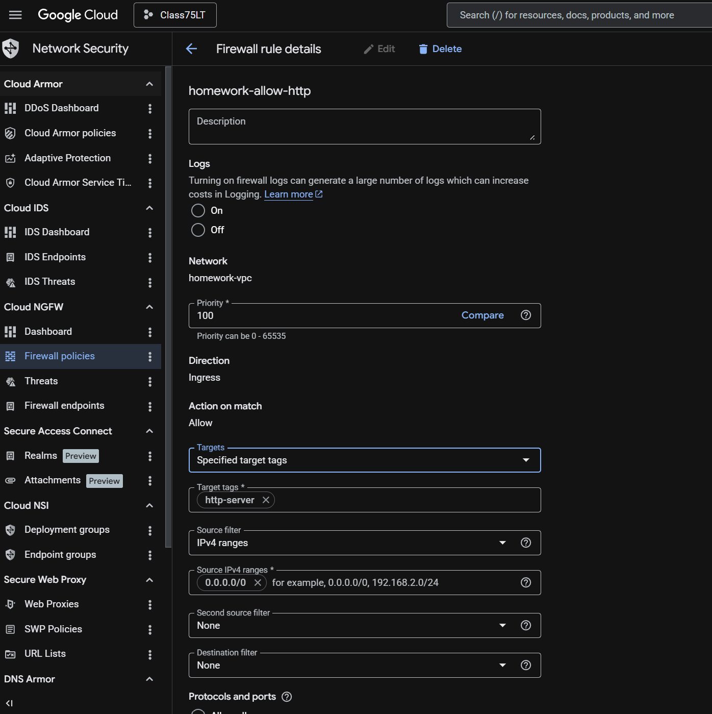

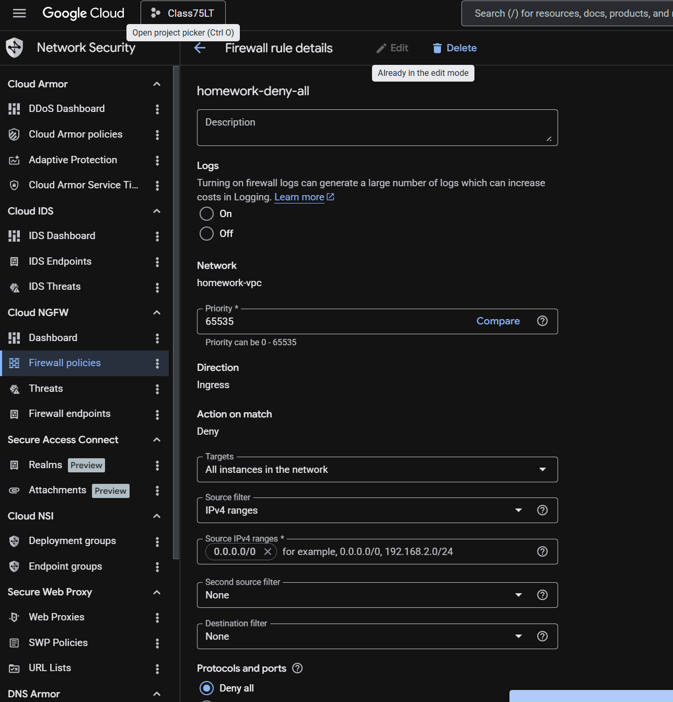

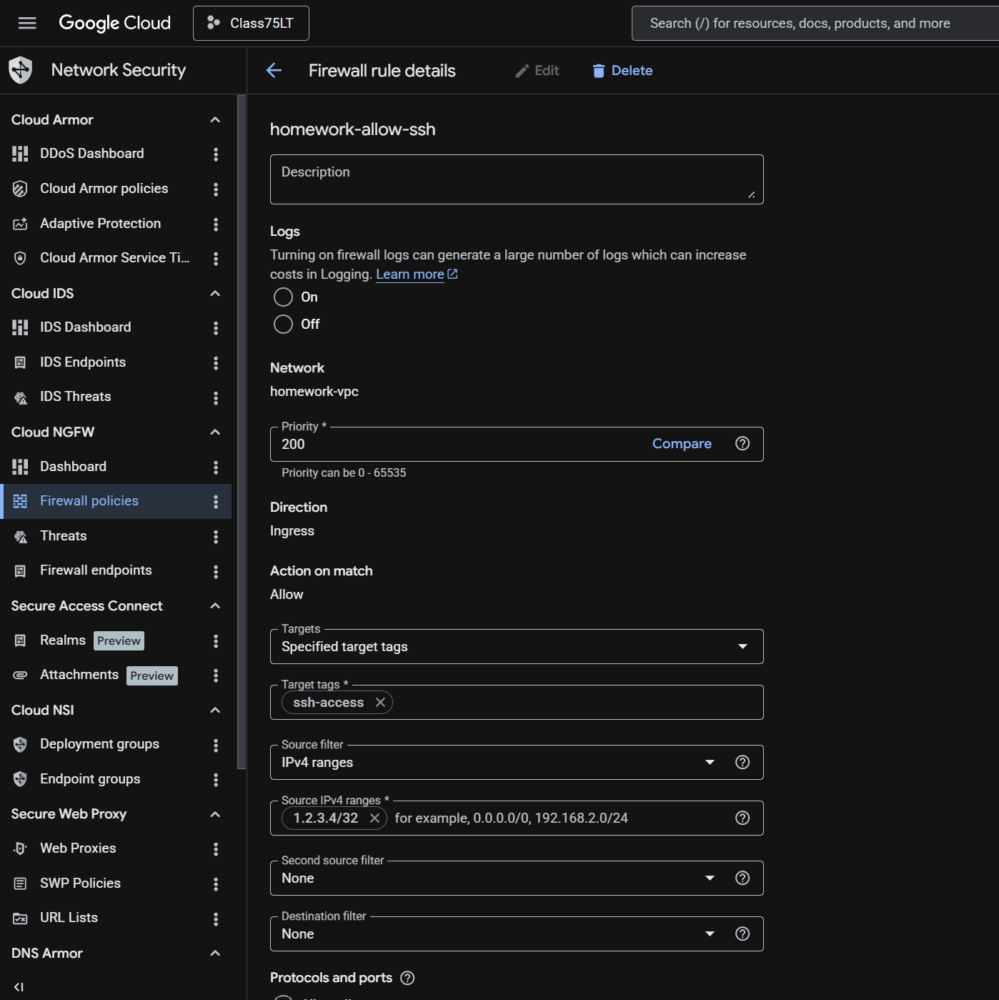

After making these changes, we tested web server access again.

The server was still not reachable.

---

## Step 5: Review the HTTP Firewall Target Tag

Next, we inspected the `homework-allow-http` firewall rule more closely.

We noticed that the HTTP firewall rule was using a target network tag. When we checked the VM instance, the required target tag was missing.

Because the firewall rule only applies to instances with the matching tag, the VM was not receiving the HTTP allow rule.

To test this, we added the required HTTP target tag to the VM instance.

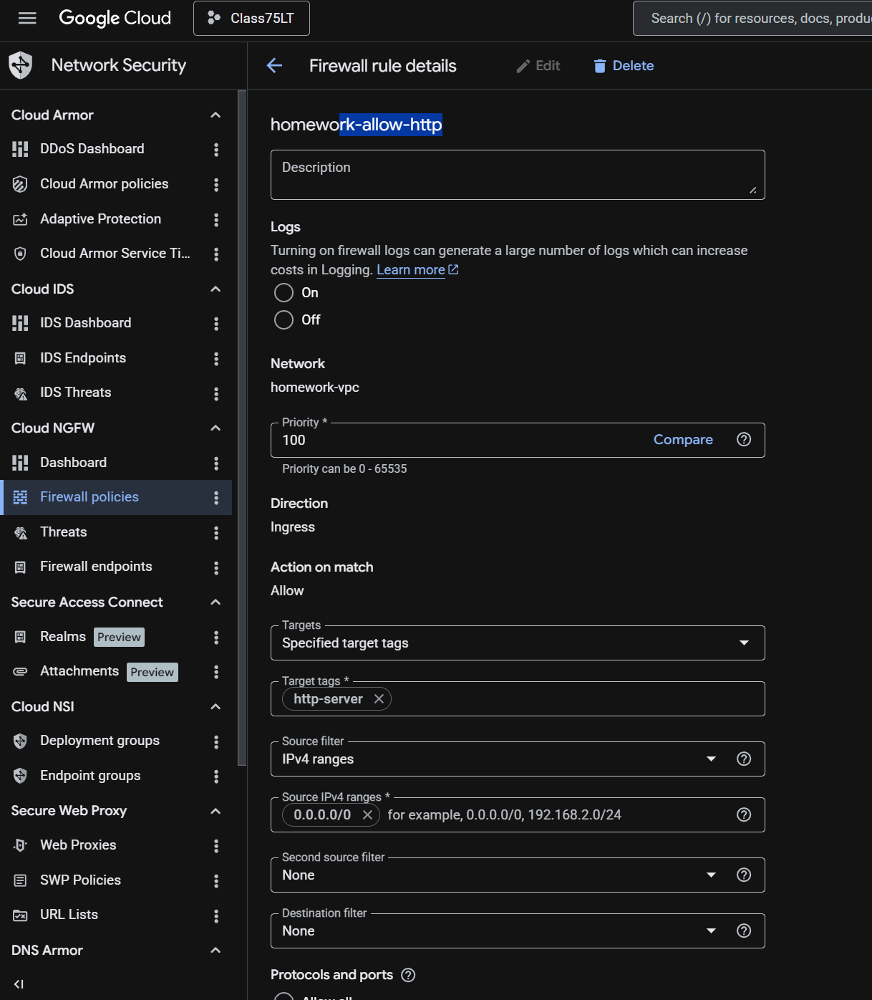

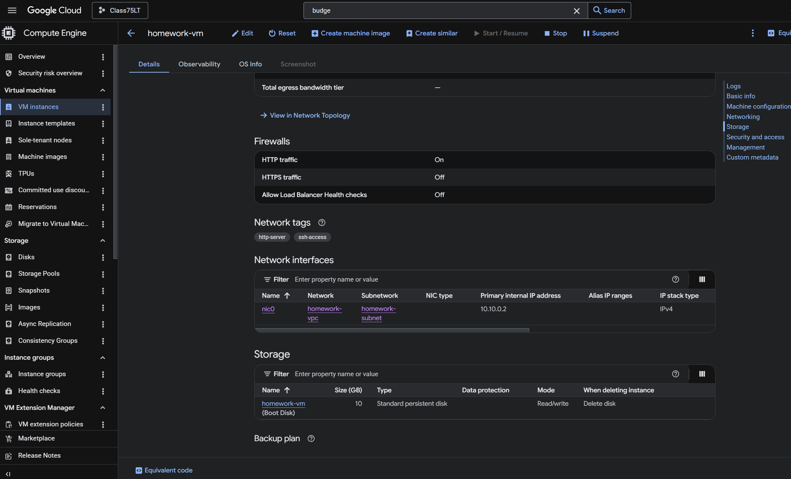

After adding the tag, we tested the web server again.

The issue was still not resolved.

---

## Step 6: Fix the SSH Source Range

We then reviewed the SSH firewall rule.

The source IP range was incorrectly configured as:

```text
1.2.3.4/32
```

This only allows SSH traffic from that specific IP address, which did not match our current client IP.

To allow SSH access for troubleshooting, we updated the SSH source range to:

```text
0.0.0.0/0
```

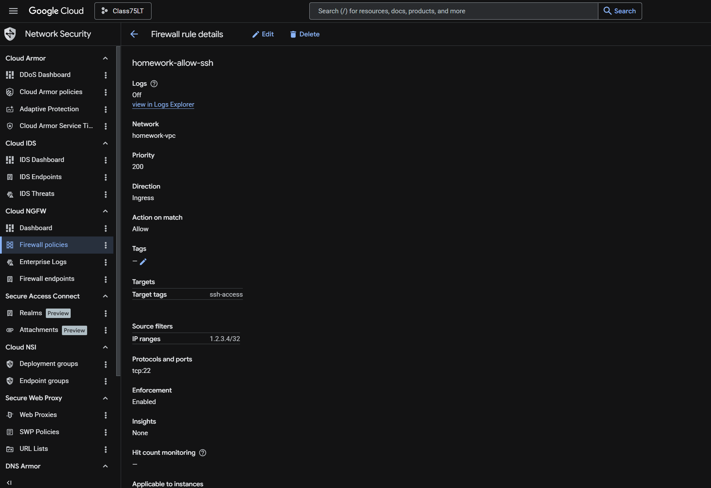

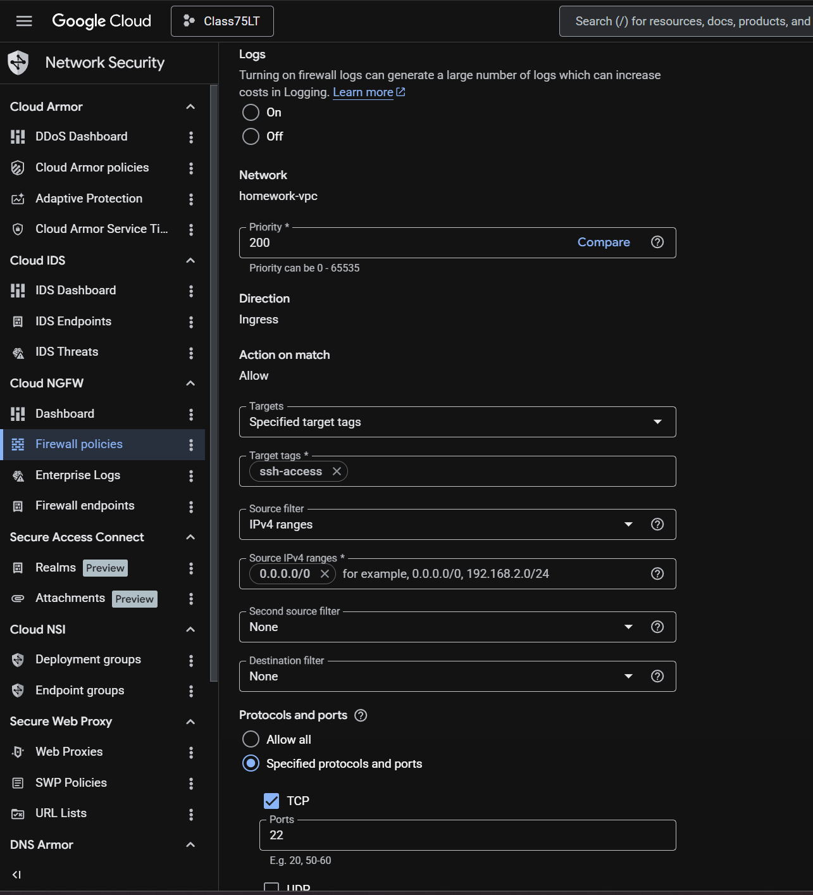

After updating the SSH rule, we were able to successfully SSH into the VM.

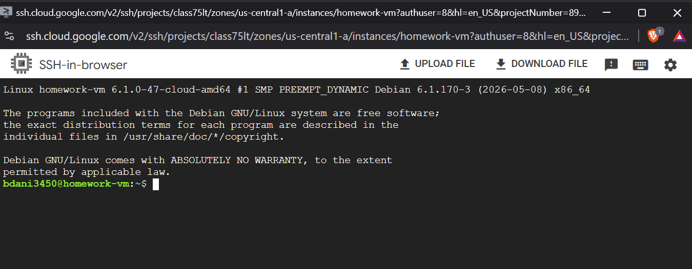

---

## Step 7: Test the Web Server Locally from the VM

Once connected to the VM over SSH, we tested the web server locally using:

```bash
curl localhost
```

The server responded with:

```text
You fixed the VM! Yay!
```

This confirmed that the web server itself was running correctly on the VM.

At this point, the issue was not with the local web service. The issue was somewhere between external traffic and the VM.

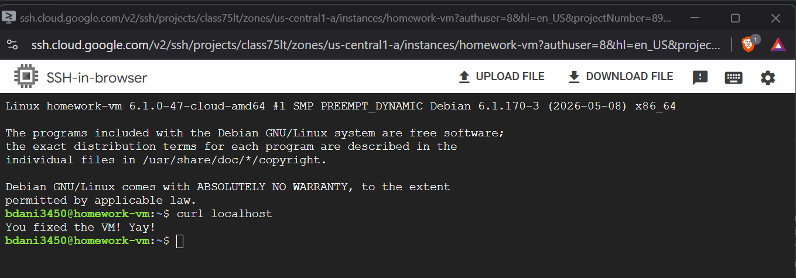

---

## Step 8: Investigate VPC Routing

After confirming that the web server worked locally, we continued investigating why external HTTP traffic still could not reach the VM.

We reviewed the VPC networking configuration and eventually found the issue in the route section. The network was not properly configured for the VM to be reached externally.

To resolve the issue, we went into route management, selected the correct VPC, and confirmed the correct region:

```text
VPC: homework-vpc
Region: us-central1
```

The route showed the VM attached to the correct VPC/subnet and confirmed the external IP path after the networking corrections were made.

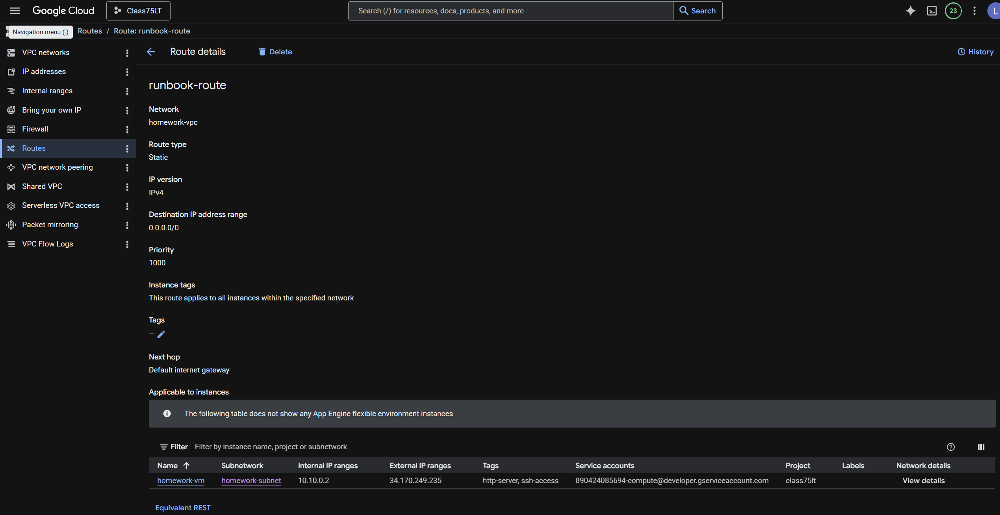

After correcting the route configuration and restarting the VM, we tested the web page again.

The web server was successfully reachable.

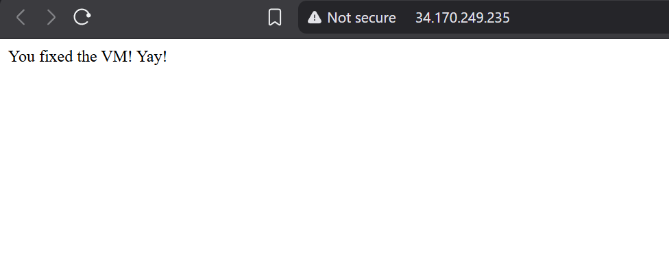

---

## Root Cause

The environment had multiple layered misconfigurations:

1. The VM initially did not have an external IP address.
2. The `homework-deny-all` firewall rule had a priority of `0`, causing it to override the allow rules.
3. The HTTP firewall rule required a target tag that was missing from the VM.
4. The SSH firewall rule allowed access only from `1.2.3.4/32`.
5. The VPC route configuration was not properly aligned for external access.

---

## Resolution Summary

The issue was resolved by:

- Assigning an ephemeral public IP to the VM
- Restarting the VM
- Lowering the priority of the `homework-deny-all` firewall rule to `65535`
- Raising the priority of the allow rules:
  - `homework-allow-http` set to `100`
  - `homework-allow-ssh` set to `200`
- Adding the required HTTP target tag to the VM
- Updating the SSH source range to `0.0.0.0/0`
- Verifying the web server locally with `curl localhost`
- Correcting the VPC route configuration
- Restarting the VM again
- Confirming external access to the web page

---

## Final Validation

After applying the required fixes, the web server became reachable externally and returned the expected success message:

```text
You fixed the VM! Yay!
```

The VM was confirmed to be running the web service correctly, and the network/firewall path was corrected to allow browser access.
